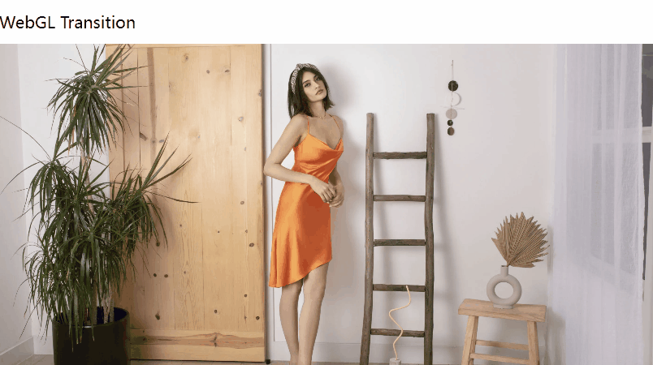

[中文](README.zh.md)

[AwesomeImage](https://awesome-image.vercel.app) is a universal image component that supports `lazy`/`progressive`/`responsive`/`automatic webp` which compatible with Vue2/Vue3/NUXT.

It can also be paired with the official WebGL filter library or a custom WebGL filter component, or the WebGL transition component for an awesome image display or button effect.
## Document
[AwesomeImage](https://awesome-image.vercel.app)

## Features

- Lazy loading —— set when to load the image and placeholder image separately
- Responsive loading  ——   load images of different sizes based on screen width
- Progressive loading  ——  load a 48px blured image as placeholder, then display the image smoothly
- SSR  ——  support server-side rendering, if specify non-lazy loading for the first screen, it will load the images before `hydrate`. And compatible with the progressive effect, improve the first screen loading experience
- WEBP compatibility —— you can use the `auto-webp` property to add a webp compatible notation when using an image service that does not support automatic webp
- WebGL filter —— `WebGL Filter Component` can be used in `AsImage` component to processe image [More](https://awesome-image.vercel.app/filter/introduction)

- WebGL transition  ——  you can use the webgl image transition component `AsTransition` to switch image with awesome webgl effect. Support [GLTransitions](https://gl-transitions.com/) and custom WebGL image transitions [More](https://awesome-image.vercel.app/transition/introduction)
- Custom image url generator  ——  @awesome-image/services has built-in image url generator rules such as fastly and upyun, you can customize other image url generator functions [More](https://awesome-image.vercel.app/url)

## Demo
[Demo](https://awesome-image-demo.vercel.app)

## Show Case
### Lazy / Responsive / Progressive / SSR

### WebGL Filter (@awesome-image/filter-fake3d)

### WebGL Transition

